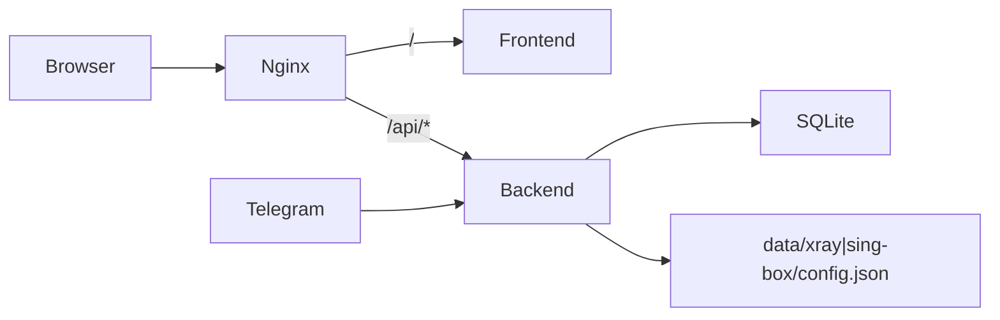

# proxy-mgr MVP — статус реализации

**Статус:** MVP реализован и проверен (Docker Engine + панель на `:8888`).

## Выполнено

### Backend (Go)
- [x] `go.mod`, `cmd/main.go`, subcommand `migrate`
- [x] Viper config (`CONFIG_PATH`, `${TELEGRAM_BOT_TOKEN}`)
- [x] GORM/SQLite: `User`, `Traffic`, `Node`
- [x] Генерация конфигов xray/sing-box (VLESS, templates)
- [x] `CoreManager`: Reload, stats polling, links, QR
- [x] REST API `/api/*` + `X-API-Key` auth
- [x] Telegram-бот: `/start`, `/users`, `/add`, `/link`, `/traffic`, `/reload`

### Frontend (React)
- [x] Vite + Tailwind + axios + react-router + recharts
- [x] Login (API key), Dashboard, Users CRUD, Settings (core switch)
- [x] LinkModal с QR (blob + auth), 401 → redirect на login

### Integration
- [x] `docker-compose.yml` (backend, frontend, nginx; cores в profile `cores`)
- [x] `Dockerfile.backend` (CGO/SQLite), `Dockerfile.frontend`, `Dockerfile.nginx`
- [x] Nginx reverse-proxy + проброс `X-API-Key`
- [x] Healthchecks, `scripts/backup.sh`, `scripts/restore.sh`
- [x] `scripts/docker-compose.sh` (compose v2, `sg docker`)
- [x] `.env.example`, `backend/config.example.yaml`

## Архитектура (runtime)



| Сервис | Порт (host) | Назначение |
|--------|-------------|------------|
| nginx | `HTTP_PORT` (8888) | Единая точка входа |
| frontend | 3000 | SPA (напрямую, без API proxy) |
| backend | 8080 | Go API |
| xray-core | profile `cores` | host network |
| sing-box | profile `cores` | host network |

## Команды

```bash
make init          # config.yaml, .env, data/
make dev           # docker compose up --build
make dev-cores     # xray + sing-box
make dev-local     # без Docker
make migrate       # БД в контейнере backend
make docker-doctor # проверка Docker
make test          # go test + npm test
```

## Известные ограничения MVP

- Один inbound VLESS на ядро; VMess/Trojan — задел в `links.go`
- Stats polling реализован для xray Stats API
- `PUT /api/core/type` — переключение ядра
- OpenAPI `/api/docs` — не реализован
- Multi-node UI — нет (модель `Node` есть)

## Post-MVP (бэклог)

- [x] OpenAPI/Swagger (`/api/docs`)
- [x] TLS/HTTPS в nginx (пример + `scripts/letsencrypt.sh`)
- [x] Протоколы VMess/Trojan в UI
- [x] E2E-тесты (Playwright + API integration)
- [x] CI (build + test)
- [ ] Подписка (subscription URL)
