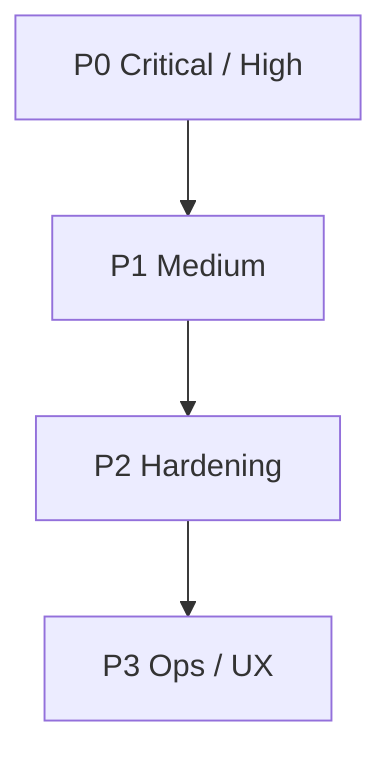

# RioNexGate — план доработок безопасности и hardening

**Статус:** в работе (P0)  
**Контекст:** аудит MVP (2026-10-08). Панель — single-admin self-hosted; дефолтный деплой небезопасен для internet-facing.

Связано с: [.cursor/plans/mvp.md](mvp.md)

---

## Фазы

| Фаза | Цель | Состояние |
|------|------|-----------|
| **P0** | Закрыть угон доступа и утечку секретов в дефолте | сделано (этот PR) |
| **P1** | Enforce лимитов, SSRF/injection, nginx | частично (ExpiresAt, JSON-escape, nginx headers/limit) |
| **P2** | Контейнеры, CORS, deps, бэкапы | бэклог |
| **P3** | Invite-токены, ротация ключей, OpenAPI auth | бэклог |

---

## P0 — Critical / High (этот PR)

### P0.1 Закрыть `POST /api/client/register`
- [x] По умолчанию регистрация **не открыта**
- [x] Разрешено при: `X-API-Key` **или** `X-Registration-Secret` (= `server.registration_secret`)
- [x] Opt-in `server.allow_open_register: true` только для доверенной LAN (логировать warning)
- [x] Обновить OpenAPI, README, e2e, integration tests

### P0.2 Отвергать слабый / пустой `api_key` при старте
- [x] Пустой ключ и плейсхолдеры (`change-me-to-secure-key`, `change-me`, …) → fatal
- [x] Constant-time compare в middleware
- [x] `make init` генерирует случайный `api_key`

### P0.3 Xray Stats API не на `0.0.0.0`
- [x] Ввести `core.xray.api_listen` (bind); `api_address` — куда ходит backend
- [x] Default listen: `127.0.0.1:<port>` (не `0.0.0.0`)
- [x] Пример конфига + комментарий про Docker bridge / firewall

### P0.4 Не публиковать backend/frontend наружу
- [x] Compose: `127.0.0.1:8080:8080`, `127.0.0.1:3000:80`
- [x] Единая точка входа — nginx `:8888`

### P0.5 Права на конфиги с ключами
- [x] `writeConfigAtomic` / AWG → `0600`

### P0.6 Device token не в query + логи
- [x] Убрать `?token=` из device auth
- [x] Access log без query string

### P0.7 `restore.sh` path traversal
- [x] Проверка членов архива + extract только `data/`

---

## P1 — Medium (следом / частично в этом PR)

### P1.1 Enforce `ExpiresAt` (и опционально квоты)
- [x] `ListActiveUsers`: `active AND (expires_at IS zero OR expires_at > now)`
- [x] Device auth / subscription: reject expired
- [ ] (позже) auto-disable при превышении `TrafficGB`

### P1.2 JSON-escape в шаблонах ядер
- [x] `jsonString` / `jsonStringList` через `encoding/json`

### P1.3 Nginx: headers + rate limit
- [x] `X-Content-Type-Options`, `X-Frame-Options`, `Referrer-Policy`
- [x] `limit_req` на `/api/`

### P1.4 SSRF-ограничения
- [ ] Блок private/link-local для `test-dest` и node health (opt-out для LAN)

---

## P2 — Hardening (бэклог)

- [ ] CORS: явный origin вместо `*`
- [ ] Non-root containers, `cap_drop: ALL`, `no-new-privileges`, `read_only` где возможно
- [ ] Pin `sing-box` / amneziawg image digests
- [ ] Не класть default `config.yaml` в образ (только example)
- [ ] Шифрование бэкапов; SQLite `0600`
- [ ] MaxBytesReader на JSON body
- [ ] Обновить axios / npm audit
- [ ] Закрыть или защитить `/api/docs` в prod (`server.enable_docs`)

---

## P3 — Ops / продукт (бэклог)

- [ ] Per-user invite / one-time registration tokens
- [ ] Ротация API key из UI
- [ ] Подписка: короткий TTL / signed URL (уже есть token URL — усилить)
- [ ] Авто-отключение по трафику
- [ ] Security checklist в README (prod deploy)

---

## Критерии приёмки P0

1. Без API key / registration secret → `POST /api/client/register` = 401  
2. `api_key: change-me-to-secure-key` → процесс не стартует  
3. Сгенерированный xray config: API listen на `127.0.0.1`, не `0.0.0.0` (если не задан override)  
4. `docker compose` публикует 8080/3000 только на loopback  
5. Конфиги ядер на диске mode `0600`  
6. `?token=` больше не принимает device auth  
7. `restore.sh` не извлекает `../` из архива  
8. `go test ./...` зелёный  

---

## Вне скоупа этого плана

- Полный multi-user RBAC / OAuth  
- Переписывание стека (не Docker → systemd и т.п.)  
- Идеальная защита от DPI на стороне клиента  
