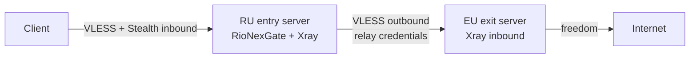

**English** | [Русский](multihop.ru.md)

# Multi-hop chains (RU entry → EU exit)

RioNexGate supports **entry → exit** proxy chains: clients connect only to the **entry** node (for example a server in Russia), while traffic exits to the Internet from the **exit** node (for example a server in the EU). The panel on the entry server generates Xray outbounds that relay user traffic to registered exit nodes.

> **Scope:** Multi-hop outbound/routing generation is implemented for **Xray-core** (`core.type: xray`). The sing-box template does not emit chain outbounds yet — use Xray on the entry server for multi-hop.

## Architecture



ASCII equivalent:

```
  Client
    |
    |  VLESS (+ Reality / XHTTP / Vision per core.stealth)
    v
  +---------------------------+
  | RU entry server           |
  | RioNexGate panel + Xray   |
  | - user inbounds           |
  | - multihop outbounds      |
  +---------------------------+
    |
    |  VLESS to exit node (stored credentials)
    v
  +---------------------------+
  | EU exit server            |
  | Xray inbound (relay user) |
  +---------------------------+
    |
    v
  Internet (EU egress IP)
```

**What clients see:** subscription links, QR codes, and RioNexTunnel configs point at the **entry** host/port only (`ResolveClientEndpoint`). Exit nodes are never published to clients.

**What the entry Xray config contains:** for each active exit node used by at least one user, the generator adds:

1. A **VLESS outbound** to the exit `address:port` with credentials from the node record.
2. A **freedom outbound** with `proxySettings` chaining through that VLESS outbound.
3. A **routing rule** mapping user emails to the chained outbound tag (`exit-<name>-chain`).

See [`backend/internal/core/templates/xray.json.tmpl`](../backend/internal/core/templates/xray.json.tmpl) and [`multihop.go`](../backend/internal/core/multihop.go).

## Deployment topology

| Server | Role | RioNexGate panel | `core.multihop` | Purpose |
|--------|------|------------------|-----------------|---------|
| RU | Entry | **Yes** (primary) | `enabled: true`, `local_role: entry` | Client-facing inbounds, chain management, outbound to EU |
| EU | Exit | Optional (local admin) | `enabled: false` | Relay inbound for entry server; traffic exits to Internet |

The **management panel lives on the entry server**. Exit servers only need a matching Xray inbound for the relay credentials you store in the exit node record. Running RioNexGate on the EU host is convenient for user/credential management but not required for the chain itself.

## Prerequisites

- Two Linux servers with network connectivity **RU → EU** on the exit inbound port.
- **Xray-core** on both hosts (`make dev-cores` or your own install).
- Entry server: RioNexGate installed (`make init`, `make up`).
- Entry server: `core.type: xray` and `core.multihop.enabled: true`.
- Exit server: a VLESS inbound (typically the same stealth stack as entry — Reality + Vision or XHTTP) and a **relay user** whose UUID you will copy into the exit node credentials on the RU panel.
- Firewall:
  - **Clients → RU:** stealth ports (default **443**, **8443**).
  - **RU → EU:** exit node `port` (TCP).
- Reality keypair on both sides if using Reality on the hop link (see [stealth.md](stealth.md)).

## Step-by-step setup

### 1. Install RioNexGate on the RU entry server

```bash
git clone https://github.com/RioTwWks/RioNexGate.git
cd RioNexGate
make init
# Edit backend/config.yaml — see entry example below
make up
make dev-cores   # start xray-core profile
```

Open the panel at `http://<ru-host>:8888` (or your HTTPS port).

### 2. Enable multi-hop on the entry server

In `backend/config.yaml` on **RU**:

```yaml
core:
  type: xray
  listen_port: 443
  public_host: "ru.example.com"
  multihop:
    enabled: true
    local_role: entry
```

Reload is automatic after API changes; for manual edits restart the backend or trigger any user/node update.

`BuildMultihopData` runs only when `multihop.enabled` is true **and** `local_role` is `entry`. Other values disable outbound generation on that host.

### 3. Prepare the EU exit server

On **EU**, run Xray with a VLESS inbound that accepts the relay connection from RU.

**Option A — RioNexGate on EU (recommended for credential sync):**

```yaml
core:
  type: xray
  listen_port: 443
  public_host: "eu.example.com"
  multihop:
    enabled: false
  stealth:
    enabled: true
    # ... Reality + Vision on 8443 (example) — see stealth.md
```

1. Create a dedicated relay user in the EU panel (e.g. `relay@eu.internal`).
2. Note the user's **UUID** and the EU inbound's **Reality public key**, **short ID**, **flow**, and **port**.

**Option B — standalone Xray:** configure an inbound manually; use the same UUID and transport parameters in the exit node credentials JSON.

### 4. Register nodes on the RU panel

**Entry node (optional but recommended)** — so client links use a explicit entry address instead of only `public_host`:

- **Nodes** → **Add node**
- Role: `entry`
- Address: client-facing hostname or IP (e.g. `ru.example.com`)
- Port: stealth primary port (e.g. `443`)
- Priority: lower number = preferred when auto-selecting (default `100`)

**Exit node (required for chain):**

- Role: `exit`
- Name: unique slug (becomes outbound tag `exit-<name>`)
- Address: EU hostname or IP reachable from RU
- Port: EU inbound port (e.g. `8443` for Vision)
- Protocol: `vless` (default)
- Region: e.g. `EU` (informational)
- Priority: for auto-assignment when users have no explicit exit
- **Credentials:** JSON — see schema below

Example credentials (Vision + Reality hop):

```json
{
  "uuid": "550e8400-e29b-41d4-a716-446655440000",
  "flow": "xtls-rprx-vision",
  "security": "reality",
  "public_key": "EU_REALITY_PUBLIC_KEY",
  "short_id": "a1b2c3d4",
  "fingerprint": "firefox",
  "network": "tcp"
}
```

Example credentials (XHTTP + Reality hop):

```json
{
  "uuid": "550e8400-e29b-41d4-a716-446655440000",
  "security": "reality",
  "public_key": "EU_REALITY_PUBLIC_KEY",
  "short_id": "a1b2c3d4",
  "fingerprint": "firefox",
  "network": "xhttp",
  "path": "/api/v1/data",
  "mode": "stream-one"
}
```

| Field | Required | Default | Description |
|-------|----------|---------|-------------|
| `uuid` | Yes (VLESS) | — | Relay user UUID on the exit server |
| `encryption` | No | `none` | VLESS encryption |
| `flow` | For Vision | — | e.g. `xtls-rprx-vision` |
| `security` | No | `none` | Set `reality` for Reality hops |
| `public_key` | For Reality | — | Exit inbound Reality public key (`pbk`) |
| `short_id` | For Reality | — | Exit inbound short ID |
| `sni` | No | exit `address` | TLS/Reality SNI |
| `fingerprint` | No | `firefox` | uTLS fingerprint |
| `network` | No | `tcp` | `tcp` or `xhttp` |
| `path`, `mode` | For XHTTP | — | XHTTP path and mode (`stream-one`) |

Schema: [`backend/internal/models/node.go`](../backend/internal/models/node.go).

### 5. Create users and assign chains

**UI:** open a user → **Multi-hop chain** section → choose entry/exit (or leave **Auto**) → **Save chain**.

**Auto selection:** if `entry_node_id` / `exit_node_id` is empty, the panel picks the **lowest `priority`** among **active** nodes of that role (`ORDER BY priority ASC, id ASC`).

**API:** see examples below.

After assignment, `core.Reload()` regenerates `data/xray/config.json` with outbounds and per-user routing.

### 6. What clients receive

- VLESS links use the **resolved entry** `address:port` (entry node or `core.public_host` + `listen_port`).
- Subscription and `GET /api/client/config` never include the exit hostname.
- End-user clients use a **single-hop** profile (entry only); chaining happens server-side on RU.

### 7. Health checks and active flag

- **Nodes** page → **Health check** — TCP dial to `address:port` (`GET /api/nodes/{id}/health`).
- Toggle **Active** / **Inactive**: inactive nodes are skipped for auto-resolution and should not be assigned to new users.
- Before production cutover, health-check exit from the RU host:

```bash
nc -zv eu.example.com 8443
```

Health check validates TCP reachability only, not VLESS/Reality handshake.

### 8. Stealth on entry (XHTTP + Reality)

Enable `core.stealth` on the **RU entry** server as in [stealth.md](stealth.md). Client traffic is masked on the first hop (RU); after the entry Xray accepts the session, routing sends it through the EU exit outbound. DPI sees client ↔ RU; egress IP is EU.

Typical production stack:

- **Client → RU:** VLESS + Reality + XHTTP (`stream-one`) on 443
- **RU → EU:** VLESS + Reality + Vision on 8443 (or XHTTP if you prefer)

## Configuration examples

### RU entry — `backend/config.yaml`

```yaml
server:
  port: 8080
  api_key: "change-me-to-secure-key"

database:
  path: "./data/rionexgate.db"

core:
  type: xray
  listen_port: 443
  public_host: "ru.example.com"
  multihop:
    enabled: true
    local_role: entry
  xray:
    config_path: "./data/xray/config.json"
    binary_path: "/usr/local/bin/xray"
    api_address: "host.docker.internal:10085"
  stealth:
    enabled: true
    fingerprint: firefox
    reality:
      dest: "www.example-cdn.com:443"
      server_names: ["www.example-cdn.com"]
      private_key: "RU_PRIVATE_KEY"
      public_key: "RU_PUBLIC_KEY"
      short_ids: ["a1b2c3d4"]
    xhttp:
      enabled: true
      port: 443
      path: "/api/v1/data"
      mode: stream-one
    vision:
      enabled: true
      port: 8443
```

### EU exit — `backend/config.yaml`

```yaml
core:
  type: xray
  listen_port: 443
  public_host: "eu.example.com"
  multihop:
    enabled: false
  stealth:
    enabled: true
    fingerprint: firefox
    reality:
      dest: "www.other-cdn.com:443"
      server_names: ["www.other-cdn.com"]
      private_key: "EU_PRIVATE_KEY"
      public_key: "EU_PUBLIC_KEY"      # → exit node credentials.public_key
      short_ids: ["b2c3d4e5"]          # → exit node credentials.short_id
    vision:
      enabled: true
      port: 8443                       # → exit node port
```

Create relay user on EU; put that UUID in the exit node `credentials` on the RU panel.

## API examples

Replace `YOUR_KEY` with `server.api_key`. Base URL: `http://localhost:8888/api` (via nginx) or `http://localhost:8080/api` (backend direct).

### List nodes

```bash
curl -s -H "X-API-Key: YOUR_KEY" http://localhost:8888/api/nodes | jq .
```

### Create exit node

```bash
curl -s -X POST http://localhost:8888/api/nodes \
  -H "X-API-Key: YOUR_KEY" \
  -H "Content-Type: application/json" \
  -d '{
    "name": "exit-eu",
    "address": "eu.example.com",
    "port": 8443,
    "role": "exit",
    "protocol": "vless",
    "region": "EU",
    "priority": 10,
    "active": true,
    "credentials": "{\"uuid\":\"550e8400-e29b-41d4-a716-446655440000\",\"flow\":\"xtls-rprx-vision\",\"security\":\"reality\",\"public_key\":\"EU_PUBLIC_KEY\",\"short_id\":\"b2c3d4e5\",\"fingerprint\":\"firefox\"}"
  }'
```

### Create entry node

```bash
curl -s -X POST http://localhost:8888/api/nodes \
  -H "X-API-Key: YOUR_KEY" \
  -H "Content-Type: application/json" \
  -d '{
    "name": "entry-ru",
    "address": "ru.example.com",
    "port": 443,
    "role": "entry",
    "region": "RU",
    "priority": 10,
    "active": true
  }'
```

### Bind user chain

```bash
curl -s -X PUT http://localhost:8888/api/users/1/chain \
  -H "X-API-Key: YOUR_KEY" \
  -H "Content-Type: application/json" \
  -d '{
    "entry_node_id": 1,
    "exit_node_id": 2
  }'
```

Clear explicit bindings (fall back to auto):

```bash
curl -s -X PUT http://localhost:8888/api/users/1/chain \
  -H "X-API-Key: YOUR_KEY" \
  -H "Content-Type: application/json" \
  -d '{"clear": true}'
```

You can also set `entry_node_id` / `exit_node_id` via `PUT /api/users/{id}` with `clear_chain: true`.

### Health check

```bash
curl -s -H "X-API-Key: YOUR_KEY" http://localhost:8888/api/nodes/2/health | jq .
```

Example response:

```json
{
  "reachable": true,
  "check_type": "tcp",
  "latency_ms": 42
}
```

### Verify generated Xray config (entry server)

```bash
docker compose exec xray-core xray run -test -c /path/to/data/xray/config.json
# Look for "exit-exit-eu" outbound and routing to "exit-exit-eu-chain"
```

## Troubleshooting

| Symptom | Likely cause | Fix |
|---------|--------------|-----|
| Traffic exits from RU IP, not EU | User has no exit binding; no active exit nodes; `multihop` disabled or wrong `local_role` | Enable multihop on entry; create active exit node; assign `exit_node_id` |
| No outbounds in `config.json` | `core.type` is sing-box, or no users mapped to an exit | Switch entry to `xray`; ensure at least one user resolves to an exit |
| `invalid exit node` on chain API | Wrong role or missing node | `role` must be `exit` / `entry` respectively |
| RU cannot reach EU | Firewall, wrong port, EU xray down | `nc -zv`; open EU port from RU; run health check |
| VLESS handshake fails RU→EU | Credentials JSON mismatch | Match UUID, `public_key`, `short_id`, `flow`, `network`, `path`, `mode` to EU inbound |
| Client links show wrong host | Entry node address/port | Update entry node or user `entry_node_id`; check `ResolveClientEndpoint` |
| Health OK but chain broken | TCP-only check | Test hop with `xray run -test` and live traffic; verify relay user is active on EU |
| Outbound tag conflicts | Duplicate node `name` | Node names are unique; tag is `exit-<name>` |

**Credentials format:** must be valid JSON in the `credentials` string field. Escape quotes in curl (`\"`) or use a JSON file with `-d @exit-node.json`.

**Firewall ports summary:**

| Direction | Port | Service |
|-----------|------|---------|
| Internet → RU | 443, 8443 | Client stealth inbounds |
| RU → EU | exit node port | Inter-node VLESS hop |
| Admin → RU | 8888 (or HTTPS) | Panel only — do not expose EU panel publicly if unused |

## Security notes

- **Exit credentials are secrets.** They grant relay access to the EU inbound. Store only on the entry server's database; restrict API key and panel access.
- **Do not expose the exit node in subscriptions, QR codes, or client configs.** RioNexGate strips exit hosts from client-facing output by design — do not bypass this with manual links.
- **Use a dedicated relay UUID** on EU, not end-user UUIDs, so hop authentication is isolated.
- **Separate Reality keypairs** for RU (client-facing) and EU (hop) are recommended.
- **TLS for the panel** on the entry server (see [README.md](../README.md#https-lets-encrypt)).
- Deleting an exit node clears `exit_node_id` on affected users automatically.

## Production checklist

- [ ] RU: `core.multihop.enabled: true`, `local_role: entry`, `core.type: xray`
- [ ] EU: relay inbound listening; relay user UUID active
- [ ] Exit node credentials match EU inbound (UUID, Reality keys, flow, network)
- [ ] RU → EU TCP reachable (`/api/nodes/{id}/health` or `nc`)
- [ ] Entry node registered with client-facing `address:port`
- [ ] Users assigned `exit_node_id` (or auto exit with correct priority)
- [ ] `xray run -test` passes on entry; config contains `exit-<name>` and `-chain` outbounds
- [ ] Client subscription shows **entry** host only
- [ ] Egress IP test from client shows **EU** (e.g. `curl ifconfig.me` through proxy)
- [ ] Stealth presets tested on entry ([stealth.md](stealth.md) checklist)
- [ ] API key rotated from default; EU panel firewalled or disabled if unused

## See also

- [stealth.md](stealth.md) — Reality, XHTTP, Vision on the entry hop
- [README.md](../README.md) — installation and Makefile
- [docs/README.md](README.md) — documentation index
- OpenAPI: `GET /api/docs` — `Nodes` and `PUT /users/{id}/chain`
