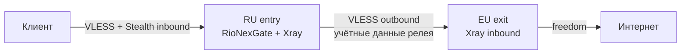

**[English](multihop.md)** | Русский

# Мульти-хоп цепочки (RU entry → EU exit)

RioNexGate поддерживает цепочки прокси **entry → exit**: клиенты подключаются только к **входному** узлу (например, сервер в России), а в Интернет трафик выходит с **выходного** узла (например, сервер в ЕС). Панель на entry-сервере генерирует Xray outbound'ы, которые ретранслируют трафик пользователей на зарегистрированные exit-узлы.

> **Область применения:** генерация outbound/routing для цепочек реализована для **Xray-core** (`core.type: xray`). Шаблон sing-box пока не создаёт chain outbound'ы — для мульти-хопа используйте Xray на entry-сервере.

## Архитектура



ASCII-эквивалент:

```
  Клиент
    |
    |  VLESS (+ Reality / XHTTP / Vision по core.stealth)
    v
  +---------------------------+
  | RU entry-сервер           |
  | Панель RioNexGate + Xray  |
  | - inbound пользователей   |
  | - multihop outbound'ы     |
  +---------------------------+
    |
    |  VLESS на exit-узел (credentials из БД)
    v
  +---------------------------+
  | EU exit-сервер            |
  | Xray inbound (relay user) |
  +---------------------------+
    |
    v
  Интернет (egress IP в ЕС)
```

**Что видит клиент:** ссылки подписки, QR-коды и конфиги RioNexTunnel указывают только на **entry** host/port (`ResolveClientEndpoint`). Exit-узлы клиентам не публикуются.

**Что содержит Xray-конфиг на entry:** для каждого активного exit-узла, используемого хотя бы одним пользователем, генератор добавляет:

1. **VLESS outbound** на `address:port` exit-узла с credentials из записи узла.
2. **freedom outbound** с `proxySettings`, цепляющимся к этому VLESS outbound.
3. **Правило routing**, сопоставляющее email пользователей с тегом chained outbound (`exit-<name>-chain`).

См. [`backend/internal/core/templates/xray.json.tmpl`](../backend/internal/core/templates/xray.json.tmpl) и [`multihop.go`](../backend/internal/core/multihop.go).

## Топология развёртывания

| Сервер | Роль | Панель RioNexGate | `core.multihop` | Назначение |
|--------|------|-------------------|-----------------|-----------|
| RU | Entry | **Да** (основная) | `enabled: true`, `local_role: entry` | Inbound для клиентов, управление цепочками, outbound в EU |
| EU | Exit | Опционально (локальный админ) | `enabled: false` | Inbound-реле для entry; выход в Интернет |

**Панель управления находится на entry-сервере.** На exit-серверах нужен только соответствующий Xray inbound для relay credentials, сохранённых в записи exit-узла. RioNexGate на EU удобен для управления пользователями, но для самой цепочки не обязателен.

## Предварительные требования

- Два Linux-сервера с сетевой связностью **RU → EU** на порту exit inbound.
- **Xray-core** на обоих хостах (`make dev-cores` или собственная установка).
- Entry-сервер: установленный RioNexGate (`make init`, `make up`).
- Entry-сервер: `core.type: xray` и `core.multihop.enabled: true`.
- Exit-сервер: VLESS inbound (обычно тот же stealth-стек, что и на entry — Reality + Vision или XHTTP) и **relay-пользователь**, UUID которого вы скопируете в credentials exit-узла на RU-панели.
- Файрвол:
  - **Клиенты → RU:** stealth-порты (по умолчанию **443**, **8443**).
  - **RU → EU:** `port` exit-узла (TCP).
- Пара Reality-ключей на обеих сторонах, если на hop-линке используется Reality (см. [stealth.ru.md](stealth.ru.md)).

## Пошаговая настройка

### 1. Установите RioNexGate на RU entry-сервере

```bash
git clone https://github.com/RioTwWks/RioNexGate.git
cd RioNexGate
make init
# Отредактируйте backend/config.yaml — см. пример entry ниже
make up
make dev-cores   # профиль xray-core
```

Откройте панель: `http://<ru-host>:8888` (или ваш HTTPS-порт).

### 2. Включите мульти-хоп на entry-сервере

В `backend/config.yaml` на **RU**:

```yaml
core:
  type: xray
  listen_port: 443
  public_host: "ru.example.com"
  multihop:
    enabled: true
    local_role: entry
```

Перезагрузка после изменений API автоматическая; при ручном редактировании перезапустите backend или выполните любое обновление user/node.

`BuildMultihopData` выполняется только когда `multihop.enabled: true` **и** `local_role: entry`. Другие значения отключают генерацию outbound на этом хосте.

### 3. Подготовьте EU exit-сервер

На **EU** запустите Xray с VLESS inbound, принимающим relay-соединение с RU.

**Вариант A — RioNexGate на EU (рекомендуется для синхронизации credentials):**

```yaml
core:
  type: xray
  listen_port: 443
  public_host: "eu.example.com"
  multihop:
    enabled: false
  stealth:
    enabled: true
    # ... Reality + Vision на 8443 (пример) — см. stealth.ru.md
```

1. Создайте выделенного relay-пользователя в панели EU (например, `relay@eu.internal`).
2. Запишите **UUID** пользователя и параметры EU inbound: **публичный ключ Reality**, **short ID**, **flow**, **порт**.

**Вариант B — standalone Xray:** настройте inbound вручную; используйте те же UUID и транспортные параметры в JSON credentials exit-узла.

### 4. Зарегистрируйте узлы на RU-панели

**Entry-узел (опционально, но рекомендуется)** — чтобы клиентские ссылки использовали явный entry-адрес, а не только `public_host`:

- **Nodes** → **Add node**
- Role: `entry`
- Address: клиентский hostname или IP (например, `ru.example.com`)
- Port: основной stealth-порт (например, `443`)
- Priority: меньшее число = выше приоритет при авто-выборе (по умолчанию `100`)

**Exit-узел (обязателен для цепочки):**

- Role: `exit`
- Name: уникальный slug (тег outbound: `exit-<name>`)
- Address: hostname или IP EU, доступный с RU
- Port: порт EU inbound (например, `8443` для Vision)
- Protocol: `vless` (по умолчанию)
- Region: например, `EU` (информационно)
- Priority: для авто-назначения, если у пользователя нет явного exit
- **Credentials:** JSON — см. схему ниже

Пример credentials (Vision + Reality hop):

```json
{
  "uuid": "550e8400-e29b-41d4-a716-446655440000",
  "flow": "xtls-rprx-vision",
  "security": "reality",
  "public_key": "EU_REALITY_PUBLIC_KEY",
  "short_id": "a1b2c3d4",
  "fingerprint": "firefox",
  "network": "tcp"
}
```

Пример credentials (XHTTP + Reality hop):

```json
{
  "uuid": "550e8400-e29b-41d4-a716-446655440000",
  "security": "reality",
  "public_key": "EU_REALITY_PUBLIC_KEY",
  "short_id": "a1b2c3d4",
  "fingerprint": "firefox",
  "network": "xhttp",
  "path": "/api/v1/data",
  "mode": "stream-one"
}
```

| Поле | Обязательно | По умолчанию | Описание |
|------|-------------|--------------|----------|
| `uuid` | Да (VLESS) | — | UUID relay-пользователя на exit-сервере |
| `encryption` | Нет | `none` | Шифрование VLESS |
| `flow` | Для Vision | — | например, `xtls-rprx-vision` |
| `security` | Нет | `none` | `reality` для Reality hop |
| `public_key` | Для Reality | — | Публичный ключ Reality exit inbound (`pbk`) |
| `short_id` | Для Reality | — | Short ID exit inbound |
| `sni` | Нет | `address` exit | TLS/Reality SNI |
| `fingerprint` | Нет | `firefox` | uTLS fingerprint |
| `network` | Нет | `tcp` | `tcp` или `xhttp` |
| `path`, `mode` | Для XHTTP | — | path и mode XHTTP (`stream-one`) |

Схема: [`backend/internal/models/node.go`](../backend/internal/models/node.go).

### 5. Создайте пользователей и назначьте цепочки

**UI:** откройте пользователя → секция **Multi-hop chain** → выберите entry/exit (или оставьте **Auto**) → **Save chain**.

**Авто-выбор:** если `entry_node_id` / `exit_node_id` пусты, панель выбирает узел с **наименьшим `priority`** среди **активных** узлов роли (`ORDER BY priority ASC, id ASC`).

**API:** см. примеры ниже.

После назначения `core.Reload()` перегенерирует `data/xray/config.json` с outbound'ами и routing по пользователям.

### 6. Что получают клиенты

- VLESS-ссылки используют **разрешённый entry** `address:port` (entry-узел или `core.public_host` + `listen_port`).
- Подписка и `GET /api/client/config` никогда не включают hostname exit.
- Клиенты используют **однохоповый** профиль (только entry); цепочка выполняется на стороне сервера RU.

### 7. Health-check и флаг active

- Страница **Nodes** → **Health check** — TCP dial на `address:port` (`GET /api/nodes/{id}/health`).
- Переключатель **Active** / **Inactive**: неактивные узлы пропускаются при авто-разрешении.
- Перед продакшеном проверьте exit с RU:

```bash
nc -zv eu.example.com 8443
```

Health-check проверяет только TCP-доступность, не VLESS/Reality handshake.

### 8. Stealth на entry (XHTTP + Reality)

Включите `core.stealth` на **RU entry** как в [stealth.ru.md](stealth.ru.md). Трафик клиента маскируется на первом hop (RU); после приёма сессии entry Xray направляет его через EU exit outbound. DPI видит клиент ↔ RU; egress IP — EU.

Типичный продакшен-стек:

- **Клиент → RU:** VLESS + Reality + XHTTP (`stream-one`) на 443
- **RU → EU:** VLESS + Reality + Vision на 8443 (или XHTTP при необходимости)

## Примеры конфигурации

### RU entry — `backend/config.yaml`

```yaml
server:
  port: 8080
  api_key: "change-me-to-secure-key"

database:
  path: "./data/rionexgate.db"

core:
  type: xray
  listen_port: 443
  public_host: "ru.example.com"
  multihop:
    enabled: true
    local_role: entry
  xray:
    config_path: "./data/xray/config.json"
    binary_path: "/usr/local/bin/xray"
    api_address: "host.docker.internal:10085"
  stealth:
    enabled: true
    fingerprint: firefox
    reality:
      dest: "www.example-cdn.com:443"
      server_names: ["www.example-cdn.com"]
      private_key: "RU_PRIVATE_KEY"
      public_key: "RU_PUBLIC_KEY"
      short_ids: ["a1b2c3d4"]
    xhttp:
      enabled: true
      port: 443
      path: "/api/v1/data"
      mode: stream-one
    vision:
      enabled: true
      port: 8443
```

### EU exit — `backend/config.yaml`

```yaml
core:
  type: xray
  listen_port: 443
  public_host: "eu.example.com"
  multihop:
    enabled: false
  stealth:
    enabled: true
    fingerprint: firefox
    reality:
      dest: "www.other-cdn.com:443"
      server_names: ["www.other-cdn.com"]
      private_key: "EU_PRIVATE_KEY"
      public_key: "EU_PUBLIC_KEY"      # → exit node credentials.public_key
      short_ids: ["b2c3d4e5"]          # → exit node credentials.short_id
    vision:
      enabled: true
      port: 8443                       # → порт exit-узла
```

Создайте relay-пользователя на EU; поместите его UUID в `credentials` exit-узла на RU-панели.

## Примеры API

Замените `YOUR_KEY` на `server.api_key`. Базовый URL: `http://localhost:8888/api` (через nginx) или `http://localhost:8080/api` (напрямую backend).

### Список узлов

```bash
curl -s -H "X-API-Key: YOUR_KEY" http://localhost:8888/api/nodes | jq .
```

### Создание exit-узла

```bash
curl -s -X POST http://localhost:8888/api/nodes \
  -H "X-API-Key: YOUR_KEY" \
  -H "Content-Type: application/json" \
  -d '{
    "name": "exit-eu",
    "address": "eu.example.com",
    "port": 8443,
    "role": "exit",
    "protocol": "vless",
    "region": "EU",
    "priority": 10,
    "active": true,
    "credentials": "{\"uuid\":\"550e8400-e29b-41d4-a716-446655440000\",\"flow\":\"xtls-rprx-vision\",\"security\":\"reality\",\"public_key\":\"EU_PUBLIC_KEY\",\"short_id\":\"b2c3d4e5\",\"fingerprint\":\"firefox\"}"
  }'
```

### Создание entry-узла

```bash
curl -s -X POST http://localhost:8888/api/nodes \
  -H "X-API-Key: YOUR_KEY" \
  -H "Content-Type: application/json" \
  -d '{
    "name": "entry-ru",
    "address": "ru.example.com",
    "port": 443,
    "role": "entry",
    "region": "RU",
    "priority": 10,
    "active": true
  }'
```

### Привязка цепочки пользователя

```bash
curl -s -X PUT http://localhost:8888/api/users/1/chain \
  -H "X-API-Key: YOUR_KEY" \
  -H "Content-Type: application/json" \
  -d '{
    "entry_node_id": 1,
    "exit_node_id": 2
  }'
```

Сброс явных привязок (возврат к авто):

```bash
curl -s -X PUT http://localhost:8888/api/users/1/chain \
  -H "X-API-Key: YOUR_KEY" \
  -H "Content-Type: application/json" \
  -d '{"clear": true}'
```

Также можно задать `entry_node_id` / `exit_node_id` через `PUT /api/users/{id}` с `clear_chain: true`.

### Health-check

```bash
curl -s -H "X-API-Key: YOUR_KEY" http://localhost:8888/api/nodes/2/health | jq .
```

Пример ответа:

```json
{
  "reachable": true,
  "check_type": "tcp",
  "latency_ms": 42
}
```

### Проверка сгенерированного Xray-конфига (entry-сервер)

```bash
docker compose exec xray-core xray run -test -c /path/to/data/xray/config.json
# Ищите outbound "exit-exit-eu" и routing на "exit-exit-eu-chain"
```

## Устранение неполадок

| Симптом | Вероятная причина | Решение |
|---------|-------------------|---------|
| Трафик выходит с RU IP, не EU | Нет exit у пользователя; нет активных exit; multihop выключен или неверный `local_role` | Включите multihop на entry; создайте активный exit; назначьте `exit_node_id` |
| Нет outbound в `config.json` | `core.type` sing-box или нет пользователей с exit | Переключите entry на `xray`; убедитесь, что хотя бы один user резолвится в exit |
| `invalid exit node` в chain API | Неверная роль или отсутствует узел | `role` должен быть `exit` / `entry` соответственно |
| RU не достигает EU | Файрвол, неверный порт, xray на EU не запущен | `nc -zv`; откройте порт EU с RU; health-check |
| VLESS handshake RU→EU падает | Несовпадение JSON credentials | Сверьте UUID, `public_key`, `short_id`, `flow`, `network`, `path`, `mode` с EU inbound |
| Неверный host в клиентских ссылках | Адрес/порт entry-узла | Обновите entry-узел или `entry_node_id` пользователя |
| Health OK, цепочка не работает | Только TCP-проверка | Тест через `xray run -test` и живой трафик; проверьте активность relay на EU |
| Конфликт тегов outbound | Дублирующееся `name` узла | Имена уникальны; тег `exit-<name>` |

**Формат credentials:** валидный JSON в строковом поле `credentials`. Экранируйте кавычки в curl (`\"`) или используйте файл `-d @exit-node.json`.

**Сводка портов файрвола:**

| Направление | Порт | Сервис |
|-------------|------|--------|
| Интернет → RU | 443, 8443 | Stealth inbound для клиентов |
| RU → EU | порт exit-узла | Межузловой VLESS hop |
| Админ → RU | 8888 (или HTTPS) | Только панель — не открывайте EU-панель публично без нужды |

## Заметки по безопасности

- **Credentials exit — секрет.** Они дают доступ к EU inbound. Храните только в БД entry-сервера; ограничьте API key и доступ к панели.
- **Не публикуйте exit-узел в подписках, QR и клиентских конфигах.** RioNexGate намеренно скрывает exit от клиентов — не обходите это ручными ссылками.
- **Используйте отдельный relay UUID** на EU, не UUID конечных пользователей.
- **Раздельные Reality keypair** для RU (клиенты) и EU (hop) рекомендуются.
- **TLS для панели** на entry (см. [README.ru.md](../README.ru.md)).
- При удалении exit-узла `exit_node_id` у затронутых пользователей очищается автоматически.

## Продакшен-чеклист

- [ ] RU: `core.multihop.enabled: true`, `local_role: entry`, `core.type: xray`
- [ ] EU: relay inbound слушает; UUID relay-пользователя активен
- [ ] Credentials exit-узла совпадают с EU inbound (UUID, Reality keys, flow, network)
- [ ] RU → EU TCP доступен (`/api/nodes/{id}/health` или `nc`)
- [ ] Entry-узел зарегистрирован с клиентским `address:port`
- [ ] Пользователям назначен `exit_node_id` (или авто exit с верным priority)
- [ ] `xray run -test` на entry проходит; в конфиге есть `exit-<name>` и `-chain` outbound'ы
- [ ] Подписка клиента показывает только **entry** host
- [ ] Тест egress IP через прокси показывает **EU** (например, `curl ifconfig.me`)
- [ ] Stealth-пресеты на entry протестированы (чеклист в [stealth.ru.md](stealth.ru.md))
- [ ] API key сменён с дефолтного; EU-панель за файрволом или отключена, если не нужна

## См. также

- [stealth.ru.md](stealth.ru.md) — Reality, XHTTP, Vision на entry hop
- [README.ru.md](../README.ru.md) — установка и Makefile
- [docs/README.md](README.md) — индекс документации
- OpenAPI: `GET /api/docs` — `Nodes` и `PUT /users/{id}/chain`
